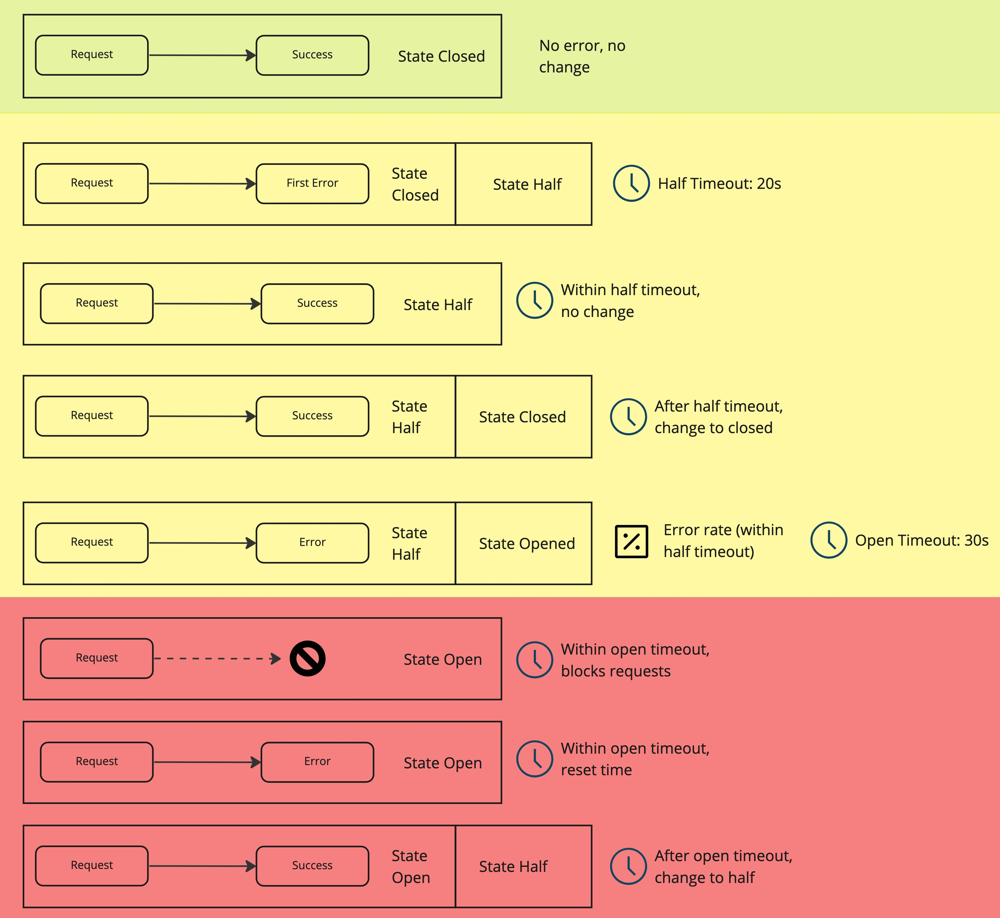
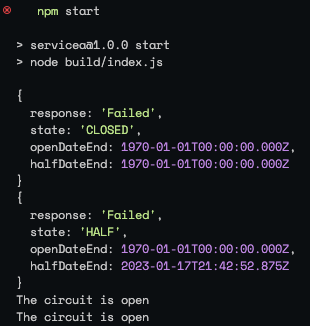
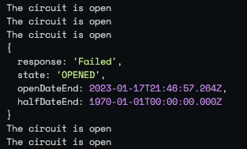
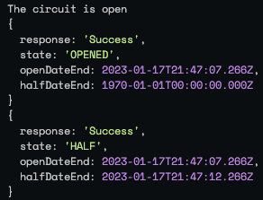

# Circuit-breaker project

## Introduction

Resilience in the **micro-services** world is a concept that should be as relevant as speed, scalability, portability, etc. but it is sometimes overlooked when designing solutions. This is because many times the concerns around network, availability, stability that would be a top priority in traditional distributed systems, seem to no longer be an issue when working with technologies like public clouds or Kubernetes.

However, EVEN if these issues are less common and the mentioned platforms have many features to reduce the possibilities or impact, in the end are in no way 100% guarantied or have some kind of restrictions. A very simple example of this is when connecting to 3rd party systems, that could not be reliable. Our systems need to be prepared and fail gracefully.

As we can see in the figure, we are describing some of the important principles we need to take into account such as cohesion and coupling, responsibility, metrics, observability, etc. when designing micro-services.


## Introducing the circuit-breaker:

It is pattern, as well as a state machine, which has 3 states (open, half-opened, and closed) that represent the flow and confidence of communication throughout the services. It does all this with the configuration of relevant limits, thresholds and timeouts with which it monitors the responses of subsequent requests from a service to another.

Depending on the implementation, the states may change names or events

The communication is managed depending on the errors. If the “target” service fails a particular number of times in a certain amount of time, the “source” service will temporarily stop sending requests. All these timeouts and rates are parameters that can be adapted to each service's expected behaviour. 

The correct calculations of this parameters and rates are a very interesting and extensive topic

If we watch each case depending on the state we will see the following:



1. For the first case (marked in green), if there is no error, the circuit remains closed with no changes
2. The second case, beginning in yellow, when we find the first error in the request, the state will change to half and begin the timeout related to this state
3. In the  third case, if subsequent requests result in success, it still will wait for the timeout to return to the “Closed” state
4. For the forth case, after the timeout has been reached, subsequent success requests will return the circuit to closed state
5. However, in the fifth case, if consecutive errors happen within the timeout and we reach a defined error rate (or minimum error requests), the circuit will change to “Open State”
6. We are now in the red area in this state, for the sixth case, a new timeout will begin, that all subsequent request will be blocked so, they won't reach the target service
7. After this timeout in the seventh case, if subsequent errors occur, the “open timeout” will start over, and block again
8. Finally, in the last case, if the subsequent request after the timeout resolves, is succesful, the state will change to half and it's own timeout will begin again

## First Demo

The technologies involved are nodejs and typescript

```
.
├── package.json
├── src
│   ├── circuitbreaker.ts
│   └── index.ts
└── tsconfig.json
```

We have the following files and directories, it is a simple node console app using Typescript

The first code file `index.ts`

```tsx
// index.ts
import { CircuitBreaker } from './circuitbreaker'

const request = (): Promise<string> => {
  return new Promise((resolve, reject) => {
    if (Math.random() > .6) {
      resolve("Success")
    } else {
      reject("Failed")
    }
  })
}

const breaker = new CircuitBreaker(request, { minFailed: 2 })

setInterval(() => breaker.fire()
  .then(console.log)
  .catch((e) => console.error(e.message)), 1000)
```

Here we have the implementation of the test. We import the circuitbreaker class, and instantiate it with 2 constructor parameters, also a function that resolves a promise randomly failing 40% of calls, and an object defining the configuration parameters we mentioned earlier. 

Finally we run as an interval every secon

The next file we are going to divide it in some parts.

In the first part we have the Options type and enum State. These will help us know in which state the circuit is, and the configuration parameters.

```tsx
export type Options = {
  halfTimeout?: number
  closedTimeout?: number
  minFailed?: number
  percentFailed?: number
}

enum State {
  OPENED = "OPENED",
  CLOSED = "CLOSED",
  HALF = "HALF"
}
```

Next we have the CircuitBreaker class which uses its Generic definition to improve the type prediction for the promises the methods resolve. 

Then we have the properties: options, dates and the current state, 

After that we have the constructor where the relevant parameters are instantiated including the “request” method.

```tsx
**export class CircuitBreaker<PAYLOAD> {**
  options: Required<Options>
  state = State.CLOSED
  openDateEnd: number | undefined = undefined
  halfDateEnd: number | undefined = undefined
  failCount = 0
  successCount = 0

  constructor(
    private request: (...args: any[]) => Promise<PAYLOAD>,
    opts?: Options
  ) {
    this.options = {
      halfTimeout: opts?.halfTimeout || 10000,
      openTimeout: opts?.openTimeout || 5000,
      minFailed: opts?.minFailed || 15,
      percentFailed: opts?.percentFailed || 50
    }
  }
//...
```

Now the methods that work the logic are mostly private except for the “fire” method that starts the execution.

- getInfo
- fire
- reset
- setOpenDate
- setHalfDate
- getFailRate
- success
- fail

```tsx
private getInfo() {
  return {
    state: this.state,
    openDateEnd: new Date(this.openDateEnd || 0),
    halfDateEnd: new Date(this.halfDateEnd || 0)
  }
}
```

The getInfo method, shows the state and dates’ properties.

```tsx
async fire(...args: any[]): Promise<any> {
  if (this.state === State.OPENED && (Date.now() < this.openDateEnd!)) {
    throw new Error('The circuit is open')
  }
  try {
    const response = await this.request(args)
    return this.success({ response: response, ...this.getInfo() })
  } catch (e: any) {
    return this.fail({ response: e, ...this.getInfo() }, args)
  }
}
```

Then the fire method, as we mentioned checks the state, if its opened and the timeout is not reached, throws an error

if is not, it will try to run the expected method

in case it succeed it will run the success method, otherwise the fail method

```tsx
private reset() {
  this.successCount = 0
  this.failCount = 0
  this.halfDateEnd = undefined
}
```

After that, there is the reset method, which restores related properties to its initial values.

```tsx
private setOpenDate() {
  this.openDateEnd = Date.now() + this.options.openTimeout
}
private setHalfDate() {
  this.halfDateEnd = Date.now() + this.options.halfTimeout
}

private getFailRate() {
  return this.failCount * 100 / (this.failCount + this.successCount)
}
```

The next methods represent the timeouts for open and half states as well as the fail rate

```tsx
private success(response: any): any {
  switch (this.state) {
    case State.HALF:
      this.successCount++
      if (Date.now() >= this.halfDateEnd!) {
        this.state = State.CLOSED
        this.reset()
      }
    case State.OPENED:
      this.failCount = 1
      this.state = State.HALF
      this.setHalfDate()
  }
  return response
}
```

The success method happens when the execution of the intended promise is, well, successful, in this case the breaker can have a different behaviour depending on the state the circuit is. 

If its in “Half” state, the success count will increase, and providing that the timeout is reached, the circuit will successfully close.

In case the circuit was opened, the state will pass to half, restarting the success count and the half timeout

In case the circuit was already closed, only the success count will increase.

```tsx
private fail(e: any, args: any[]): any {
  switch (this.state) {
    case State.OPENED:
      this.setOpenDate()
      return e

    case State.CLOSED:
      this.failCount = 1
      this.state = State.HALF
      this.setHalfDate()
      return e

    case State.HALF:
      this.failCount++

      if (Date.now() > this.halfDateEnd!) {
        this.reset()
        this.failCount = 1
        this.setHalfDate()
        return e
      }

      if (this.failCount >= this.options.minFailed) {
        if (this.getFailRate() >= this.options.percentFailed) {
          this.state = State.OPENED
          this.reset()
          this.setOpenDate()
          return e
        }
        this.reset()
        this.failCount = 1
        this.setHalfDate()
        return e
      }
  }
}
```

Finally the fail method is the longest and drives the state changes.

In case the circuit was already opened the date is reseted, in order to block connections for a while.

In case the state was closed, the circuit turn to half state, restarting the fail count and the date for the half timeout

And if the circuit was half, it will check both the timeouts and the rates in order to open the circuit or keep it in half state.

Test results:



The simulated requests are continuously sent. The second request fails so the state changes to HALF, after the forth also fails, the circuit opens and blocks subsequent requests.



After the timeout allow connection again, if the subsequent request fails, it will continue opened



And only if the request after the opened state is successful, the circuit will change to half and its timeout will begin again

## Next Demos

[GitHub - casimon-rh/gs-nodejs-demo2](https://github.com/casimon-rh/gs-nodejs-demo2)

[GitHub - casimon-rh/gs-nodejs-demo3](https://github.com/casimon-rh/gs-nodejs-demo3)

## Next Steps

As we can see, the Circuit Breaker Patter can help us manage the errors in the communication of micro-services, as well as dosing the interaction to unreliable destinations, both to avoid further saturation of the target as well as even controlling costs in error cases.

For the next steps, we could explore additional patterns and practices, such as Retry pattern, Bulkhead pattern and Chaos Engineering practice, that together with circuitbreaking, will improve even more the application's  reliability.

Another technology related is Istio, as well as the concept of Service Mesh, where we could achieve many of these patterns and implementations, not in the code, but in the immediate infrastructure, making the implementation potentially agnostic.